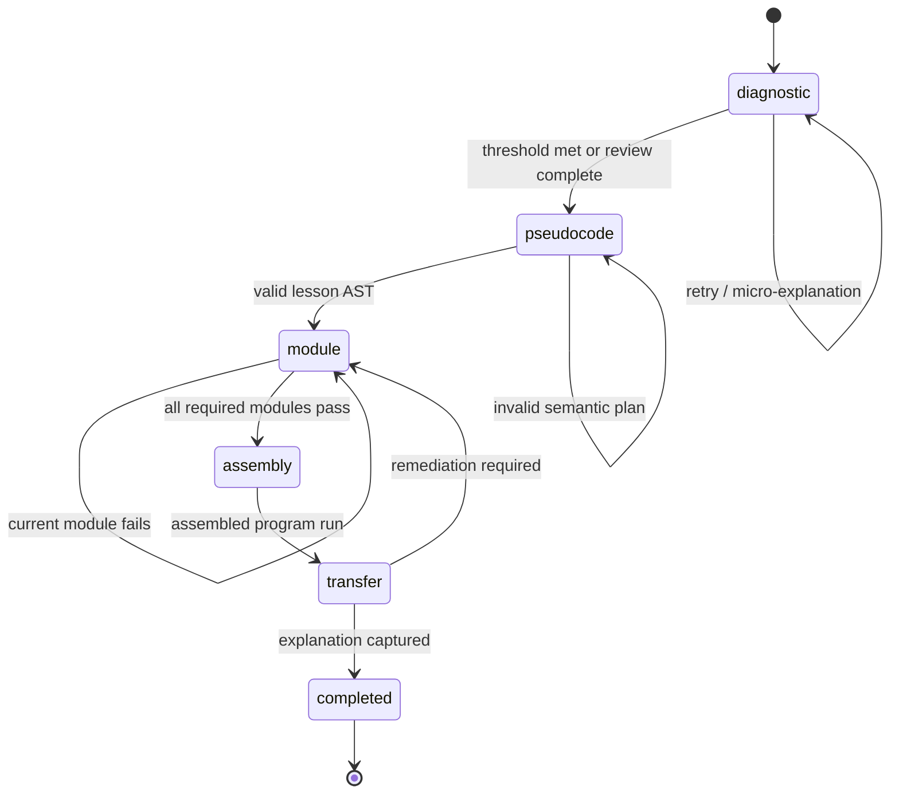

# Software design document

## Purpose

Define the software contracts for the first CodeLah vertical slice. This document is the implementation source of truth after product requirements; changes require a reviewed update to this document and relevant ADRs.

## Proposed repository layout

```text
apps/
  web/                    # React/Vite learner application
packages/
  lesson-schema/          # Zod schemas and generated types
  lesson-engine/          # State machine and deterministic validators
  pseudocode-blocks/      # Blockly block definitions and AST converter
  python-runner/          # Pyodide Worker protocol and test harness
  shared/                 # errors and local UI state definitions
content/
  lessons/calculator/v1/  # lesson JSON, tests, reviewed context cards
  infra/                    # CloudFormation static-preview plan
docs/
```

The local prototype currently implements this as a single React/Vite application under `src/`, with Blockly and a dedicated Pyodide Worker. M2 adds only the static CloudFormation delivery plan; durable session/API/model boundaries are deferred and are not scaffolded.

## Domain model

```ts
type InterestDomain =
  | 'sports'
  | 'stem_engineering'
  | 'arts_media'
  | 'games_storytelling'
  | 'business'
  | 'society_public_service';

type LessonState =
  | 'diagnostic'
  | 'pseudocode'
  | 'module'
  | 'assembly'
  | 'transfer'
  | 'completed';

interface InMemoryLessonState {
  lessonVersion: string;
  selectedDomains: InterestDomain[];
  state: LessonState;
}
```

### Lesson package

```ts
interface LessonPackage {
  id: 'python-calculator';
  version: string;
  learningObjectives: string[];
  diagnostics: DiagnosticQuestion[];
  pseudocode: PseudocodeSpecification;
  modules: CodeModule[];
  contexts: Record<InterestDomain, ContextTemplate>;
  hints: HintLadder[];
  transferCheck: TransferQuestion;
}
```

Every lesson package must be schema-validated in CI, carry a semantic version, have a complete test suite, and contain source URLs for any non-obvious factual context card.

## State machine



The deterministic browser lesson engine stores and validates the permitted state transition for M2. There is no remote completion record or entitlement; a later server-backed state model needs a new design decision.

## Pseudocode builder contract

### Allowed calculator block types

| Block | Category | Constraint |
| --- | --- | --- |
| `collect_input` | input | requires a target variable |
| `convert_to_float` | transform | must consume a collected variable |
| `select_operation` | input | must precede operation branches |
| `guard_zero_division` | validation | must guard the divide branch before calculate |
| `operation_branch` | branch | only approved operators |
| `show_error` | output | required for invalid operation and zero division |
| `show_result` | output | reachable only after valid calculation |

Blockly connection checks prevent invalid visual connections. The `PseudocodeValidator` converts the workspace into a compact AST and verifies semantic invariants. Do not compare raw Blockly XML or demand a single arbitrary block order.

Example validation result:

```ts
type PlanValidation =
  | { valid: true; completedRequirements: string[] }
  | {
      valid: false;
      issue: 'missing_zero_guard' | 'input_not_converted' | 'invalid_branch';
      activeConcept: string;
      allowedHintLevel: 1 | 2 | 3;
    };
```

## Python module runner

The `python-runner` package owns a dedicated Worker:

```text
main thread -> run(module source, fixed test fixture) -> Worker
Worker -> stdout, typed error, duration, test result -> main thread
```

Requirements:

- Provide deterministic fake `input()` values from lesson tests.
- Capture stdout/stderr as bounded strings.
- Terminate and recreate the Worker after the configured time budget.
- Refuse file/network integration and never include secrets in the Worker.
- Return a typed result, not a free-form exception blob.

```ts
type RunResult =
  | { status: 'passed'; testId: string; stdout: string; durationMs: number }
  | { status: 'failed'; testId: string; category: FailureCategory; durationMs: number }
  | { status: 'timed_out'; durationMs: number };
```

## Deferred API contract (not in M2)

There are no `/api` endpoints, cookies, or remote sessions in the public preview. The following is a future design sketch only and must be re-reviewed before an API is implemented.

All endpoints are same-origin under `/api`; cookies are Secure, HttpOnly, SameSite=Lax, and contain only an opaque signed session token.

| Endpoint | Responsibility | Response never contains |
| --- | --- | --- |
| `POST /sessions` | establish anonymous session | user identity or model key |
| `GET /lessons/:id` | serve approved lesson version | unpublished content |
| `PUT /progress` | persist validated progress delta | arbitrary state jump |
| `POST /plans/validate` | validate compact pseudocode AST | model answer |
| `POST /tutor-moves` | return bounded teaching move | full solution or provider response |
| `DELETE /sessions/current` | delete/reset anonymous progress | other learner data |

Requests and responses are validated with Zod on both client and server. Add an idempotency key to state-changing requests.

## Deferred tutor broker (not in M2)

### Input

The broker accepts only typed, minimal state:

```ts
interface TutorRequest {
  lessonId: string;
  lessonVersion: string;
  conceptId: string;
  failureCategory: FailureCategory;
  allowedHintLevel: 1 | 2 | 3;
  interestDomain?: InterestDomain;
  priorHintCount: number;
}
```

Raw learner values, full browser history, cookies, and arbitrary free-text interests are excluded. Where code context is necessary, send a sanitised AST/module representation and typed test failure, not an unrestricted transcript.

### Output and guardrails

```ts
type TutorMove =
  | { type: 'socratic_hint'; message: string; conceptId: string }
  | { type: 'micro_explanation'; message: string; conceptId: string }
  | { type: 'encouragement'; message: string }
  | { type: 'escalate'; reason: string };
```

The provider response must conform to strict JSON schema, pass a code/answer-leak detector, meet a short length limit, and refer only to the active concept. Rejection or provider failure returns the matching authored hint.

## Interest personalisation

`InterestResolver` maps selected controlled tags to a domain. `ContextComposer` selects an approved template and fact card from the lesson package. M2 uses authored text only. A future model may rephrase an approved explanation only after its own safety/evaluation decision, and cannot introduce a new field-specific fact or alter code requirements.

## Deferred telemetry contract (not in M2)

M2 sends no events. If telemetry is later approved, events need stable names and a `lessonVersion`, `state`, `conceptId`, `moduleId`, and safe outcome category. Never send raw code, user inputs, raw prompts, IP addresses, or cookies to product analytics.

## Error taxonomy

`syntax_error`, `input_conversion_missing`, `invalid_operation_missing`, `zero_division_guard_missing`, `incorrect_operation_logic`, `unexpected_output`, `worker_timeout`, `content_invalid`; reserve `provider_unavailable` for a future approved tutor feature.

Every learner-visible M2 error must map to a recovery action: retry, authored hint, or reset current module. Future tutor moves/escalation require a separate approval.
