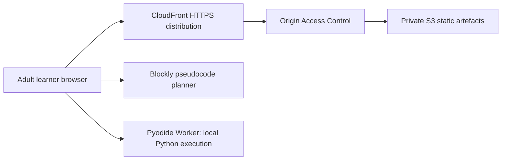

# System architecture

## Status and scope

This is the **M2 public-preview architecture**. Its AWS static-delivery infrastructure was deployed on 2026-08-18; no application artefact has been uploaded yet. It is an adult (18+) zero-data preview: there is no sign-in, application API, database, learner-data storage, external AI call, request/access log, user analytics, or persistent browser storage.

The named AWS profile `private` is in the owner-approved `ap-southeast-1` region. Stack `codelah-public-preview` is `CREATE_COMPLETE` with a private S3 bucket/policy, CloudFront distribution/OAC, three cache policies, and security headers. Its default CloudFront URL is allocated, but it will not serve the CodeLah app until the reviewed static artefact is uploaded. Untagged pre-existing resources remain outside this deployment evidence.

## M2 public-preview context

Learner selections, diagnostic answers, pseudocode, code, and program output never leave browser memory. The browser worker runs untrusted Python locally; AWS never executes learner code.

## Architecture decisions

| Concern | M2 decision | Why |
| --- | --- | --- |
| Client | React, TypeScript, Vite SPA | A guided browser flow needs no SSR, account, or API. |
| Pseudocode | Blockly with approved lesson blocks and keyboard alternative | Reuses a maintained block system without rebuilding Scratch. |
| Python execution | Pyodide in an isolated Web Worker | Fast feedback without running learner code in AWS. |
| State | Browser memory only | Meets the public-preview no-data boundary; reset/close clears state. |
| Content | Versioned lesson JSON and static build artefacts | Curriculum changes are reviewable and rollback-capable. |
| Delivery | Private S3 + CloudFront Origin Access Control | Keeps the origin private while exposing only the static app over HTTPS. |
| Infrastructure | CloudFormation no-apply template | Makes the resource graph reviewable before any AWS write. |
| Cost path | CloudFront Free flat-rate plan if eligible; explicit static-only pay-as-you-go fallback | Keeps a tight budget visible before provisioning. |

## Edge and cost controls

- S3 blocks public access and accepts reads only from the planned CloudFront distribution through signed Origin Access Control requests.
- CloudFront redirects HTTP to HTTPS, uses the default CloudFront certificate and TLS 1.2+, and only allows `GET` and `HEAD`.
- The template creates versioned S3 artefacts, a retained bucket, cache policies, and conservative response-security headers. A content-security policy is deferred until the deployed Pyodide asset flow is verified, rather than guessed and broken locally.
- Preferred path: after an explicitly approved deployment, select the CloudFront Free flat-rate plan in the CloudFront console if the account is eligible. The template deliberately contains no WAF Web ACL: an existing Web ACL prevents the plan subscription.
- Fallback: owner-approved pay-as-you-go CloudFront static delivery with no WAF Web ACL, no application logs, no write path, and AWS Shield Standard. A budget notification/cap is required before this fallback is deployed.

## Component responsibilities

| Component | Responsibilities | Does not do |
| --- | --- | --- |
| Learning shell | screen flow, focus management, in-memory progress and reset | store learner data remotely or determine correctness through AI |
| Lesson engine | deterministic unlock rules and lesson-version loading | generate arbitrary lesson content |
| Blockly adapter | approved blocks, workspace serialization, keyboard alternative | act as a general Scratch editor |
| Pseudocode validator | validate required ordering, nesting, and branch coverage | call a model to mark an answer correct |
| Code module runner | run controlled Python tests locally and report typed outcomes | access AWS credentials or external services |
| Static delivery | serve reviewed app and lesson artefacts | accept learner submissions, execute code, or create a user session |

## Data classification and retention

| Data | Treatment | Retention |
| --- | --- | --- |
| Static application and authored lesson content | public static artefact; source-controlled and versioned | retained until replacement and rollback window expiry |
| Interest tags, answers, pseudocode, code, output | untrusted and potentially personal; browser memory only | reset or browser close |
| Accounts, cookies, IP addresses, identifiers | not collected by the application | none |
| Application/request/WAF/learner analytics logs | not enabled | none |
| Aggregate service-cost information | owner operational data only | 30-day review window; no learner profiling or export |

## Reliability and rollback

| Failure | Learner behaviour | Operator response |
| --- | --- | --- |
| Pyodide timeout | terminate Worker and offer reset of the current module | verify the browser recovery path; never move code execution server-side |
| Invalid lesson build | do not publish; use prior artefact | CI blocks release; restore prior versioned S3 object only after approval |
| CloudFront/S3 delivery fault | user cannot load preview | investigate service status/configuration; roll back to a prior artefact or disable the distribution with owner approval |
| Cost-path eligibility unavailable | no impact until deployment is approved | review the explicit pay-as-you-go fallback and budget cap; do not silently add WAF or logs |

## Security invariants

- No learner code executes in Lambda, ECS, a database, or a model provider.
- No cloud credential, model key, or client-specific secret reaches the browser.
- The browser runner has a Worker timeout, fixed test inputs, and bounded output.
- The S3 origin is private; CloudFront is the sole planned public delivery edge.
- The preview has no application API or storage endpoint, so its static delivery path is intentionally constrained to `GET` and `HEAD`.
- Any future account, AI tutor, telemetry, API, persistence, upload, or institutional release requires a new architecture/security/privacy decision before implementation.

## Future architecture (not part of M2)

The previously considered API Gateway, Lambda, DynamoDB, Secrets Manager, AI tutor broker, provider evaluation, WAF rule set, and learner metrics are deferred. They are not authorized merely because they appear in older design ideas. Before a data-collecting or institutional pilot, define the tenant and consent model, a retention/deletion policy, API threat model, provider boundaries, observability limits, cost model, test/evaluation gates, owner approvals, and compensating rollback plan.

## Reuse and licence decisions

- Use the maintained Apache-2.0 [Blockly library](https://github.com/RaspberryPiFoundation/blockly), not a copied Scratch clone.
- The supplied `ksanjeeb/MIT-Scratch-Blockly` project is inspiration only; its repository page does not display a licence.
- Do not embed AGPL-3.0 [scratch-gui](https://github.com/scratchfoundation/scratch-gui) in this proprietary application.
