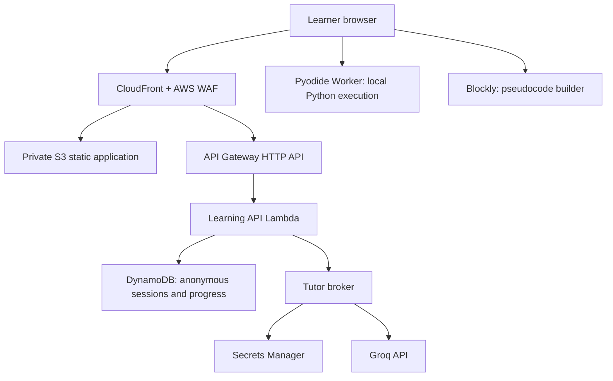

# System architecture

## Status and scope

This is the target architecture for a private pilot. It is not a record of deployed infrastructure.

**Verified AWS boundary:** named profile `private` resolves to AWS account `325212745843` through an SSO administrator role. Region, accountable owner, data classification, criticality, permitted pilot audience, and live-resource inventory are **unknown**. No AWS resources have been created.

## Context

## Architecture decisions

| Concern | Decision | Why |
| --- | --- | --- |
| Client | React, TypeScript, Vite SPA | A guided, browser-first interaction has no initial SSR or account requirement. |
| Pseudocode | Direct Blockly integration with custom lesson blocks | Reuses a maintained block system without rebuilding Scratch. |
| Python execution | Pyodide in an isolated Web Worker | Fast feedback and no arbitrary learner code in AWS workloads. |
| API | API Gateway HTTP API plus Lambda | Small private-pilot operational footprint; separates client from data and model keys. |
| State | DynamoDB with TTL | Pseudonymous short-lived session/progress state; no relational needs in MVP. |
| Content | Versioned lesson JSON in Git | Curriculum changes need review, tests, and rollback. |
| Model | Provider-neutral tutor broker; Groq first candidate | Model can be evaluated/replaced without coupling lesson rules to a provider. |
| Infra | TypeScript CDK, deployed with named profile locally then GitHub OIDC | Repeatable infrastructure and no long-lived CI credentials. |

## Network and edge controls

- S3 is private. CloudFront reads it only through Origin Access Control.
- CloudFront is the public edge; attach AWS WAF managed rules and a pilot rate limit.
- For a pre-auth private pilot, use a WAF IP allowlist approved by the pilot owner. This is deployment protection, not product identity.
- API is reachable only through the application origin; enforce CORS to the CloudFront domain and validate every request server-side.
- If Lambda is placed in a VPC later, document the required NAT/egress path before enabling Groq access. Do not add a VPC by default merely for appearance.

## Application components

| Component | Responsibilities | Does not do |
| --- | --- | --- |
| Learning shell | screen flow, focus management, progress, anonymous session bootstrapping | decide lesson correctness |
| Lesson engine | load lesson version, apply deterministic unlock rules | generate arbitrary lesson content |
| Blockly adapter | render approved blocks, serialise workspace, generate lesson AST | act as a general Scratch editor |
| Pseudocode validator | validate required ordering, nesting, and branch coverage | call a model to mark answers correct |
| Code module runner | run controlled Python tests locally and report typed outcomes | access AWS credentials or model keys |
| Learning API | create/expire session, persist safe state, serve lesson version | execute untrusted Python |
| Tutor broker | create bounded tutor request, validate structured response, apply leak checks | decide pass/fail or directly expose model provider |
| Content pipeline | validate lesson schemas, fact sources, and tests in CI | publish unreviewed generated content |

## Data classification and retention

| Data | Intended treatment | Retention |
| --- | --- | --- |
| Static lesson content | public-to-pilot content; Git versioned | source-controlled |
| Interest tags | pseudonymous learner preference | session TTL; exact duration requires approval |
| Lesson progress | pseudonymous learning state | session TTL; exact duration requires approval |
| Tutor request | minimum typed state; no raw profile/history | transient; no request-body logs |
| Groq key | confidential secret | Secrets Manager; rotation plan before pilot |
| Operational logs | request IDs, status, latency, error category | policy-defined after data classification |

The final classification is **unknown** until the institution/pilot owner approves it. Treat any potential child-linked data as sensitive during design and logging review.

## Reliability and degradation

| Failure | Learner behaviour | Operator response |
| --- | --- | --- |
| Groq unavailable | show authored hint ladder; lesson continues | alarm on broker error/latency; disable model route if sustained |
| DynamoDB unavailable | keep local work; show non-persisted state notice | investigate API/DynamoDB metrics; do not lose browser work on refresh promise |
| Pyodide timeout | terminate Worker and offer reset of current module | record typed timeout metric; never execute code server-side as a workaround |
| Invalid lesson package | do not publish; use prior immutable lesson version | CI blocks release; roll back to prior app/content artifact |

## Security invariants

- No API key or provider credential reaches the browser.
- No user code executes in Lambda, ECS, or the model provider.
- The browser runner uses a Worker timeout, fixed test inputs, CSP, and no service credentials.
- Model output must validate against a strict schema and pass answer-leak checks.
- Logs contain digests/IDs and typed outcomes, never raw prompts, code, cookies, or secrets.
- IAM is least privilege: each role receives only its explicit resource actions.

## Observability

Emit structured metrics for API error rate/latency, session starts, lesson state transitions, validator failures, Worker timeouts, model latency/failure, model response rejection, and fallback-hint usage. Use correlation IDs across CloudFront, API Gateway, Lambda, DynamoDB, and model-broker calls. Do not log raw model bodies.

## Open decisions required before provisioning

1. AWS region and environment naming.
2. Accountable product, engineering, and operations owners.
3. Formal data classification and approved retention period.
4. Pilot access control: approved IP range, VPN, or another temporary mechanism.
5. Browser support matrix, especially school-managed devices.
6. CDN/domain ownership and certificate authority.
7. Whether a separate non-production AWS account is available.

## Reuse and licence decisions

- Use the maintained Apache-2.0 [Blockly library](https://github.com/RaspberryPiFoundation/blockly), not a copied Scratch clone.
- The supplied `ksanjeeb/MIT-Scratch-Blockly` project is inspiration only; its repository page does not display a licence.
- Do not embed AGPL-3.0 [scratch-gui](https://github.com/scratchfoundation/scratch-gui) in this proprietary application.
